# 📌 rag-genAI

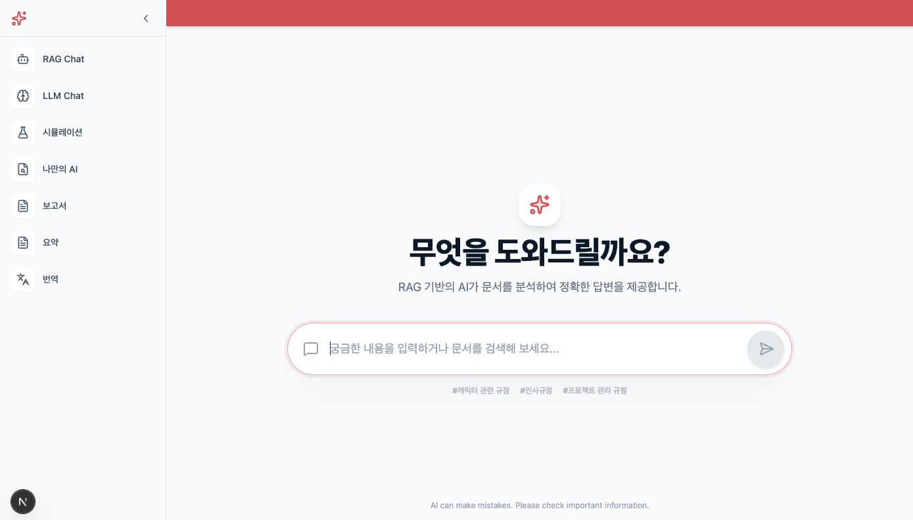

**RAG 기반 생성형 AI 웹 애플리케이션**  
Spring WebFlux 기반 비동기 백엔드 + Next.js 프론트와 함께  
**vLLM 기반 GPT-OSS 120B** 모델을 활용하여 RAG 질의응답을 수행하는 프로젝트입니다.

---

## 🚀 프로젝트 소개

`rag-genAI`는 다음을 목표로 합니다:

- **Retrieval Augmented Generation (RAG)** 파이프라인 구현
  - 질의 재작성 및 명확화 → 문서 검색 → 벡터 임베딩 → LLM 질의응답
- **GPT-OSS 120B 기반 LLM** 연동 (vLLM)
- **Spring WebFlux 기반 비동기 / 논블로킹 처리**
- **Next.js 기반 웹 UI** 제공

> 본 프로젝트의 RAG 파이프라인은  
> **질의 재작성 → 질의 명확화 → 검색 → 리랭킹 → 컨텍스트 구성 → LLM 생성**  
> 순으로 구성되어 있습니다.

---

## 📋 주요 기능

### ✨ 기능 요약

- 질의 재작성(Query Rewrite) 및 질의 명확화(Query Clarification)
- RAG 기반 질의응답 (검색 + 문맥 증강 + 생성)
- WebFlux 기반 전체 비동기 처리
- LLM 응답 스트리밍 처리 가능
- REST API 기반 프론트 ↔ 백엔드 통신
- 프론트엔드에서 질의 입력 및 결과 확인

---

## 🛠 기술 스택

| 영역       | 기술                                     |
| ---------- | ---------------------------------------- |
| LLM        | vLLM + GPT-OSS 120B                      |
| 언어       | Java21, TypeScript                       |
| 백앤드     | Spring Boot 2.7 + **WebFlux (Reactive)** |
| 프론트앤드 | Next.js + Tailwind CSS                   |
| 검색       | OpenSearch Vector DB                     |
| 리랭킹     | FastAPI + BAAI/bge-reranker-base         |
| 임베딩     | FastAPI + BAAI/bge-base-en-v1.5          |

---

## 📁 프로젝트 구조

```
rag-genAI/
├── backend/         # Spring Boot WebFlux 서버
├── frontend/        # Next.js 기반 UI
├── rag/             # 검색 엔진 및 임베딩/리랭킹 API 도커 환경
├── assets/          # 문서 / 리소스
└── README.md
```

---

## ⚡ 빠른 시작 (Clone → 실행)

아래 순서대로 진행하면 **로컬 환경에서 바로 실행**할 수 있습니다.

### 📥 1) 저장소 클론

```bash
git clone https://github.com/tableMinPark/rag-genAI.git
cd rag-genAI
```

---

## 📌 검색 엔진 및 임베딩, 리랭킹 API 실행 방법

```bash
cd rag
docker compose up -d
```

컨테이너 기동 여부 확인:

```bash
 docker container list -a
CONTAINER ID   IMAGE            COMMAND                   CREATED          STATUS          PORTS                                                                NAMES
a95fa437581c   rag-opensearch   "./opensearch-docker…"   29 seconds ago   Up 28 seconds   0.0.0.0:9200->9200/tcp, 9300/tcp, 0.0.0.0:9600->9600/tcp, 9650/tcp   opensearch
fbbebc623a09   rag-embedding    "uvicorn app:app --h…"   29 seconds ago   Up 28 seconds   0.0.0.0:8000->8000/tcp                                               embedding
7865318dbc66   rag-reranker     "uvicorn app:app --h…"   29 seconds ago   Up 28 seconds   0.0.0.0:8001->8000/tcp                                               reranker
```

검색 엔진 인덱스 생성 여부 확인:

```bash
 curl http://localhost:9200/_cat/indices\?v
health status index                     uuid                   pri rep docs.count docs.deleted store.size pri.store.size
yellow open   gen_ai                    8miVKqCiRkC_H_hvPJ5dhw   1   1        207            0      4.7mb          4.7mb
yellow open   gen_myai                  VN5sI_PKT-KxpVJV_1laKw   1   1          3            0     87.9kb         87.9kb
```

---

## 📌 프론트엔드 (Next.js) 실행 방법

```bash
cd frontend
npm install
npm run dev
```

브라우저 접속:

```
http://localhost:3000
```

---

## ⚙️ 백엔드 설정 (`application.yml`)

```yaml
server:
  port: 8080
spring:
  application:
    name: genai
  servlet:
    multipart:
      max-file-size: 300MB
      max-request-size: 300MB
  h2:
    console:
      enabled: true
  datasource:
    url: jdbc:h2:mem:test;DB_CLOSE_DELAY=-1
    username: sa
    password:
    driverClassName: org.h2.Driver
  jpa:
    defer-datasource-initialization: true
    open-in-view: false
    properties:
      hibernate:
        show_sql: true
        format_sql: false
        hbm2ddl:
          auto: update
engine:
  # 인덱스 컬렉션
  collection:
    connect-time-out: 5000
    response-time-out: 300000
    read-time-out: 300000
    write-time-out: 300000
    host: localhost
    port: 9200
  # 인덱스 검색
  search:
    connect-time-out: 5000
    response-time-out: 300000
    read-time-out: 300000
    write-time-out: 300000
    host: localhost
    port: 9200
  # 인덱스 색인
  indexer:
    connect-time-out: 5000
    response-time-out: 300000
    read-time-out: 300000
    write-time-out: 300000
    host: localhost
    port: 9200
  # 임베딩 데이터
  embed:
    connect-time-out: 5000
    response-time-out: 300000
    read-time-out: 300000
    write-time-out: 300000
    host: localhost
    port: 8000
    path: /embed
  # 리랭크
  reranker:
    connect-time-out: 5000
    response-time-out: 300000
    read-time-out: 300000
    write-time-out: 300000
    host: localhost
    port: 8001
    path: /rerank
  # LLM
  llm:
    connect-time-out: 5000
    response-time-out: 300000
    read-time-out: 300000
    write-time-out: 300000
    host: ${LLM_SERVER_HOST}
    port: ${LLM_SERVER_PORT}
    path: ${LLM_SERVER_PATH}
    model-name: openai/gpt-oss-120b
    # 모델 응답 형식 지정 (VLLM)
    platform: vllm
    # 모델 지원 토큰 수
    model-context-limit: 128000
    internal-token-overhead: 120
    # 출력 토큰 계산 안전 마진 값
    safety-margin: 256
    # 최소 출력 토큰
    min-output-tokens: 64
    # 최대 출력 토큰
    max-output-tokens: 4096
file:
  # 파일 저장 루트 디렉토리 경로
  file-store-path: ${FILE_STORE_PATH}
chunk:
  # 기본 청킹 사이즈
  token-size: 1400
  # 기본 청킹 오버랩 크기
  overlap-size: 200
```

LLM Stream 응답 형식:

```json
{
  "id": "chatcmpl-id",
  "object": "chat.completion",
  "created": 1770653409,
  "model": "openai/gpt-oss-120b",
  "choices": [
    {
      "index": 0,
      "delta": {
        "role": "assistant",
        "content": "안녕하세요! 무엇을 도와드릴까요?",
        "refusal": null,
        "annotations": null,
        "audio": null,
        "function_call": null,
        "tool_calls": [],
        "reasoning": "The user says \"안녕\" which is Korean for \"Hello\". We should respond in Korean, greeting back. Keep it friendly.",
        "reasoning_content": "The user says \"안녕\" which is Korean for \"Hello\". We should respond in Korean, greeting back. Keep it friendly."
      },
      "logprobs": null,
      "finish_reason": "stop",
      "stop_reason": null,
      "token_ids": null
    }
  ],
  "service_tier": null,
  "system_fingerprint": null,
  "usage": {
    "prompt_tokens": 71,
    "total_tokens": 119,
    "completion_tokens": 48,
    "prompt_tokens_details": null
  },
  "prompt_logprobs": null,
  "prompt_token_ids": null,
  "kv_transfer_params": null
}
```

---

## ▶️ 백엔드 실행 방법

```bash
cd backend
chmod 755 ./gradlew
./gradlew clean bootjar
java -jar build/libs/rag-genai-2.1.0.jar
```

또는 개발 모드:

```bash
./gradlew bootRun
```

백엔드 기본 주소:

```
http://localhost:8080/api
```

---

## 🧠 질의 재작성(Query Rewrite) & 질의 명확화

본 프로젝트의 RAG 파이프라인은 **사용자 입력 질의를 그대로 검색에 사용하지 않습니다.**

LLM을 활용하여 다음 과정을 거칩니다:

1. **질의 재작성 (Query Rewrite)**
   - 사용자의 자연어 질의를 검색 친화적인 형태로 재작성
   - 불필요한 수식어 제거
   - 핵심 키워드 중심의 질의로 변환

2. **질의 명확화 (Query Clarification)**
   - 모호하거나 포괄적인 질의를 구체적인 검색 질의로 보정
   - 의도 파악이 어려운 경우 문맥 중심으로 의미 보강

이를 통해:

- **검색 정확도 향상**
- **불필요한 문서 검색 감소**
- **LLM 응답 품질 개선**
- **RAG 전체 파이프라인 효율 증가**

이라는 효과를 얻을 수 있습니다.

---

## 🧠 WebFlux 기반 비동기 처리

본 프로젝트는 **Spring WebFlux**를 사용하여 다음과 같은 특징을 가집니다:

- 논블로킹 I/O 기반 처리
- 검색 → RAG → LLM 호출까지 Reactive Stream으로 연결
- 고동시성 환경에서도 안정적인 처리 가능
- LLM 호출과 같은 I/O 중심 작업에 최적화

---

## 🧠 vLLM 기반 GPT-OSS 120B

- **GPT-OSS 120B** 모델 기준으로 개발
- vLLM을 활용한 고속 추론 환경 전제
- OpenAI API 의존 없이 **오픈소스 LLM 서버 연동 구조**
- GPU 환경에서 최적의 성능 발휘

---

## 🧩 기능 상세 설명

### 🤖 RAG 기반 AI 질의

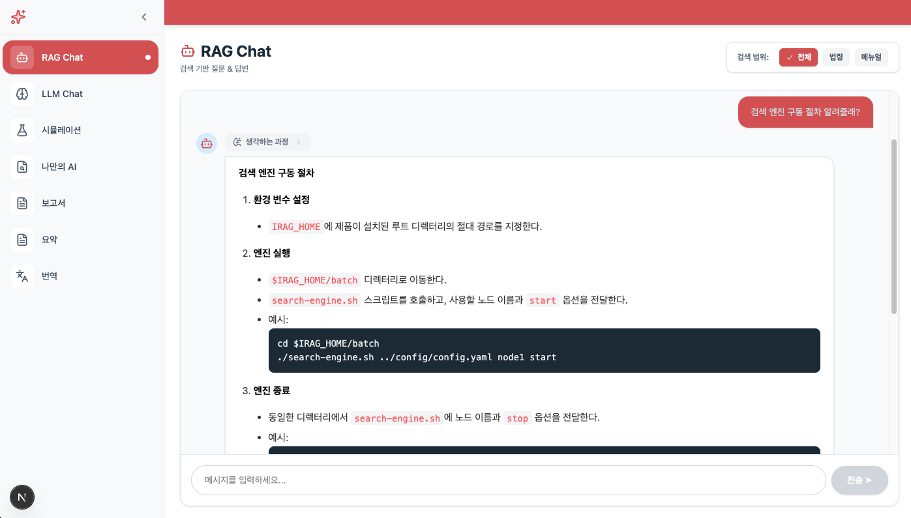

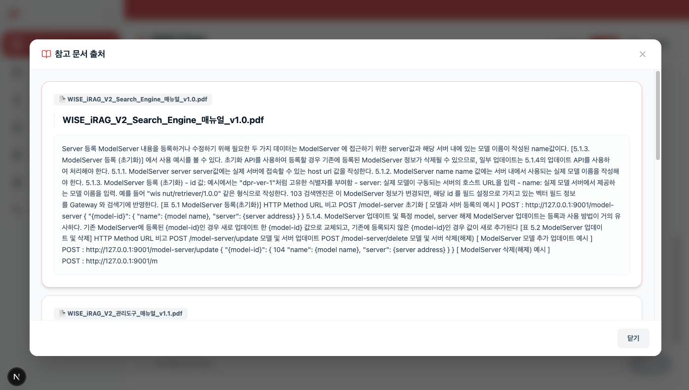

검색 엔진(OpenSearch)과 RAG 파이프라인을 결합하여  
**검색 데이터 기반의 신뢰도 높은 답변**을 제공합니다.

- 사용자 질의 → **질의 재작성 / 명확화**
- 벡터 검색 기반 관련 문서 조회
- 리랭킹을 통한 컨텍스트 정제
- 정제된 컨텍스트를 기반으로 LLM 응답 생성

> 단순 LLM 응답이 아닌,  
> **검색 결과에 근거한 답변**을 제공하는 것이 핵심 목적입니다.

---

### 💬 LLM 기반 자유 질의

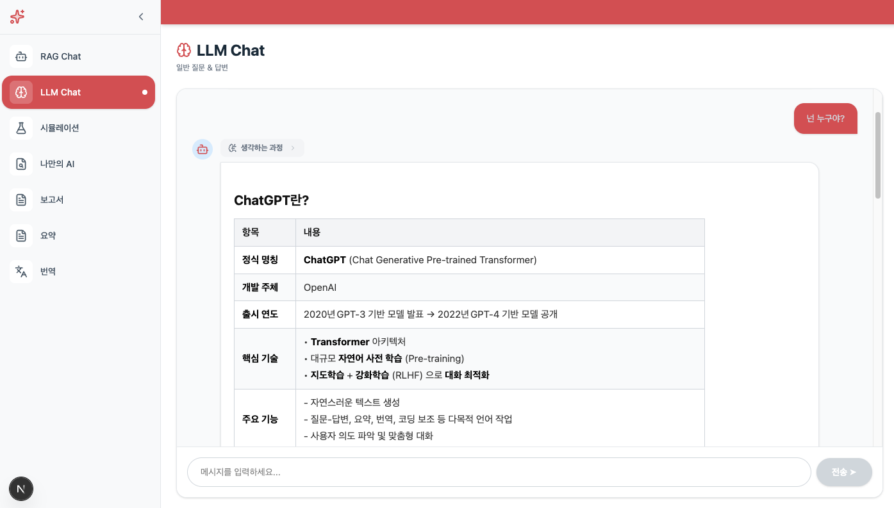

검색이나 문서 제약 없이 **LLM 자체의 추론 능력**을 활용한 자유 질의 기능입니다.

- 일반적인 대화형 질의
- 아이디어 브레인스토밍
- 개념 설명, 코드 설명 등

RAG가 필요하지 않은 경우에도  
**LLM을 유연하게 활용할 수 있는 기본 질의 모드**입니다.

---

### 🧪 LLM 시뮬레이션

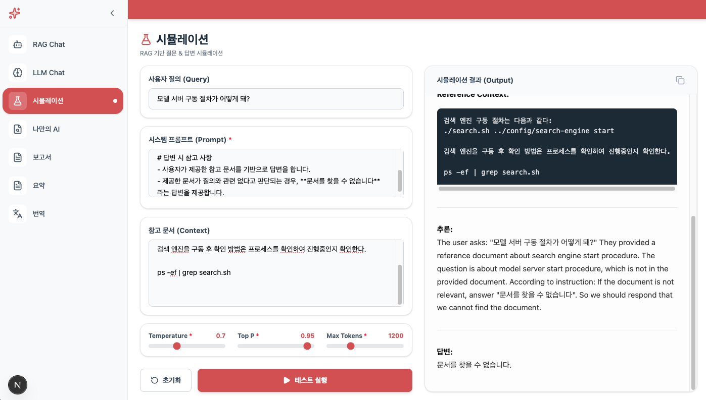

LLM의 다양한 옵션을 조절하며 **응답 결과를 비교/검증**할 수 있는 기능입니다.

- Temperature, Top-P, Max Tokens 등 파라미터 조절
- 동일 질의에 대해 서로 다른 응답 결과 비교
- 프롬프트 설계 및 응답 특성 실험 용도

> LLM 응답 특성을 이해하고  
> 최적의 설정을 찾기 위한 **실험용 기능**입니다.

---

### 🧠 나만의 AI (Private RAG)

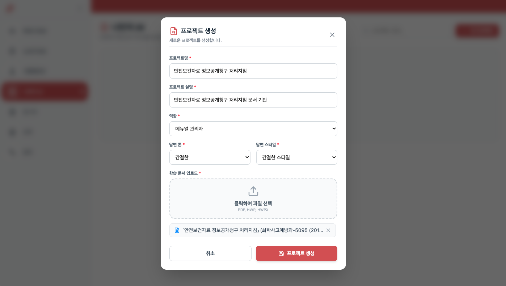

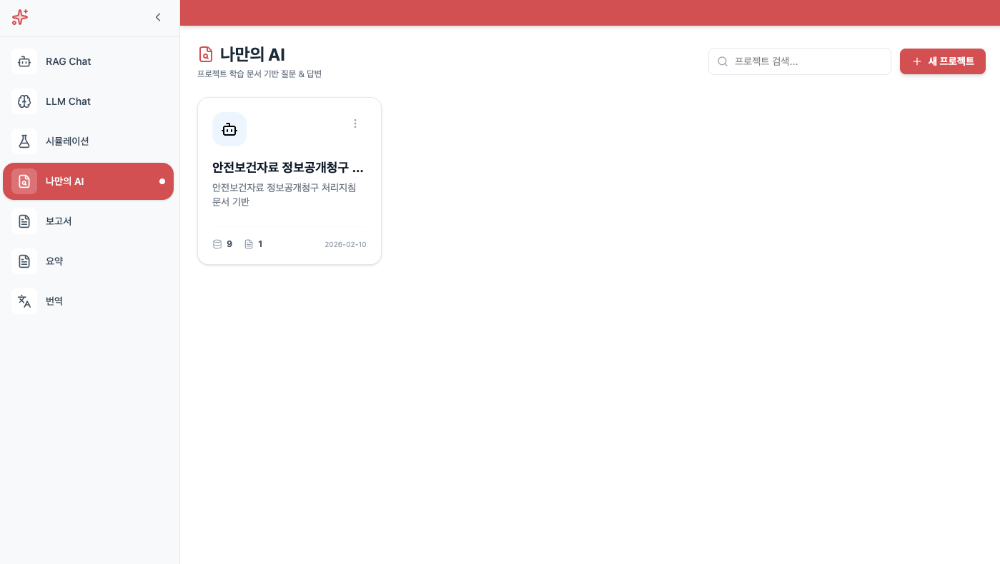

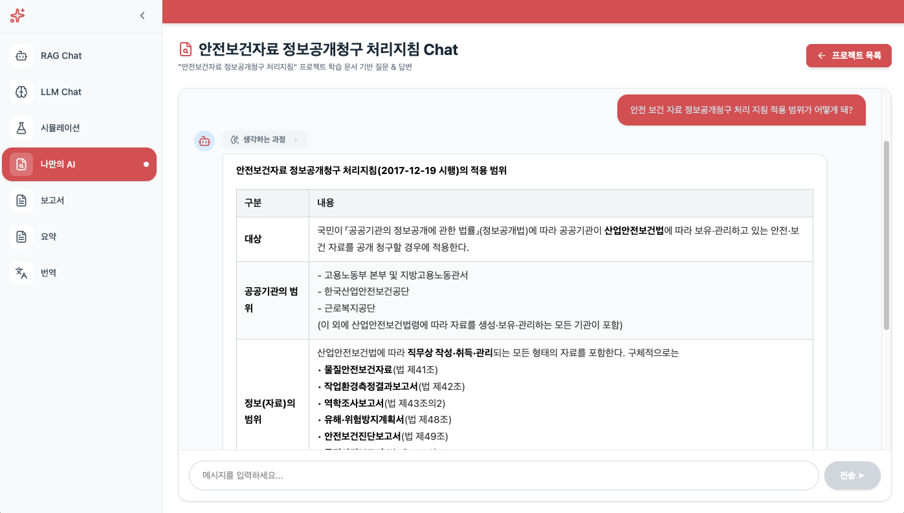

사용자가 직접 업로드한 문서만을 기반으로  
**개인화된 RAG 질의응답**을 제공합니다.

- PDF / 텍스트 문서 업로드
- 문서 청킹 + 임베딩
- 해당 문서 컬렉션에 대해서만 RAG 질의 수행
- 외부 데이터와 완전히 분리된 RAG 환경

> 개인 문서, 내부 자료 등  
> **외부로 노출되면 안 되는 데이터 기반 질의**에 적합합니다.

---

### 📝 보고서 생성

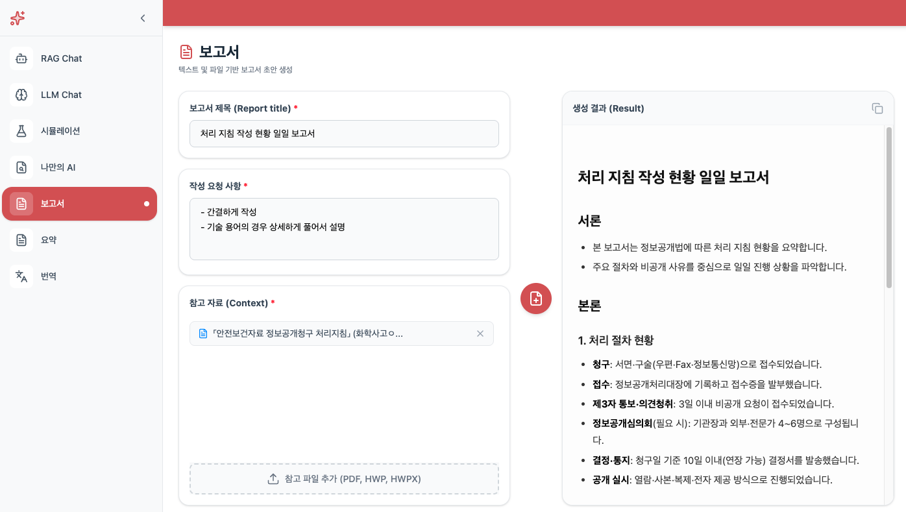

문서를 업로드하고 사용자의 요구사항을 입력하면  
**Markdown 기반 보고서 초안**을 자동 생성합니다.

#### 처리 프로세스

1. 문서 분할(Chunking)
2. **부분 요약 수행**
3. 부분 요약 결과를 기반으로 **전체 요약**
4. 전체 요약문을 활용하여 보고서 구조 생성
5. Markdown 형식의 보고서 초안 출력

> 대용량 문서에서도  
> 요약 품질과 구조를 유지하기 위한 단계적 요약 전략을 사용합니다.

---

### ✂️ 요약 (Summary)

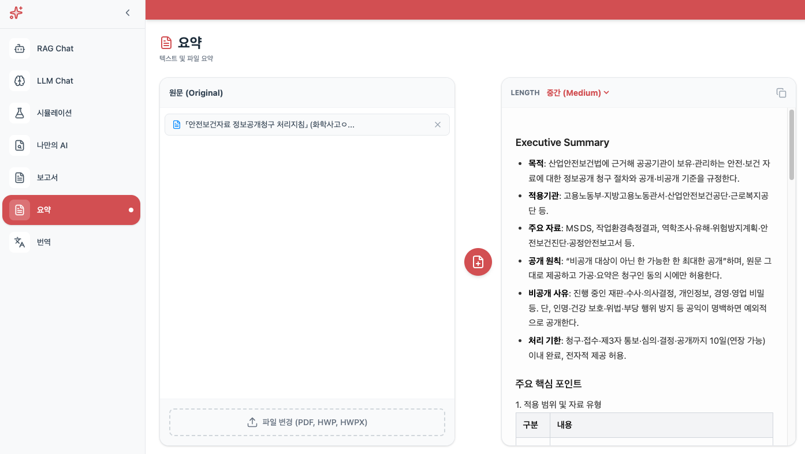

특정 문서에 대해 **요약 길이를 선택**하여 요약문을 생성합니다.

- 짧은 요약 / 중간 요약 / 긴 요약 선택 가능
- 대용량 문서 대응을 위한 **부분 요약 → 전체 요약** 구조

보고서 생성, 문서 이해, 빠른 내용 파악 등  
다양한 시나리오에서 활용할 수 있습니다.

---

### 🌍 번역 (Translation)

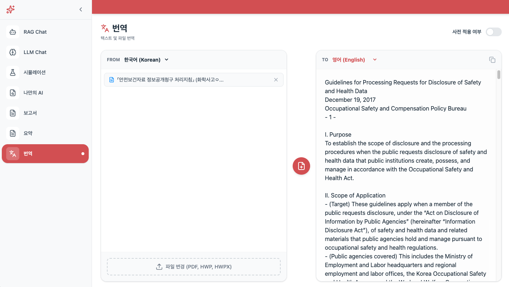

특정 문서에 대해 **전체 내용을 번역**하는 기능입니다.

- 문서 분할 후 요약 또는 원문 기반 처리
- **Spring WebFlux 기반 병렬 처리**
- 번역 결과를 **순차적으로 병합**
- 아호코라식 알고리즘 적용하여 번역 사전 반영한 번역문을 작성하도록 구현

#### 특징

- 번역 작업을 리액티브 스트림으로 병렬 처리
- 결과는 문서 순서를 유지하여 병합
- 대용량 문서에서도 안정적인 처리 가능

---

## 🔄 공통 설계 특징

### 🧠 멀티턴 대화 지원

질의와 관련된 모든 기능은 다음 정보를 기반으로 동작합니다:

- 이전 대화 히스토리
- 대화 상태 요약(Context Summary)
- 현재 질의의 의도

이를 통해:

- 이전 대화를 고려한 응답
- 문맥이 끊기지 않는 질의 흐름
- 자연스러운 멀티턴 대화 경험

을 제공합니다.

---

### ⚡ WebFlux 기반 비동기 처리

모든 API는 **Spring WebFlux 기반**으로 구현되어 있습니다.

- Client는 API 응답을 블로킹하지 않음
- LLM 호출, 요약, 번역 등 I/O 작업을 비동기 처리
- 스트리밍 응답을 통한 빠른 사용자 피드백

> 특히 요약, 번역, 보고서 생성과 같은  
> **시간이 오래 걸리는 작업에 최적화된 구조**입니다.

---

## 🎯 프로젝트 요약

- ✅ 질의 재작성 및 명확화를 포함한 고품질 RAG 파이프라인
- ✅ RAG 기반 생성형 AI 시스템
- ✅ WebFlux 기반 비동기/논블로킹 처리
- ✅ vLLM + GPT-OSS 120B 기준 개발
- ✅ 빠르게 실행 가능한 개발 환경 제공

---
