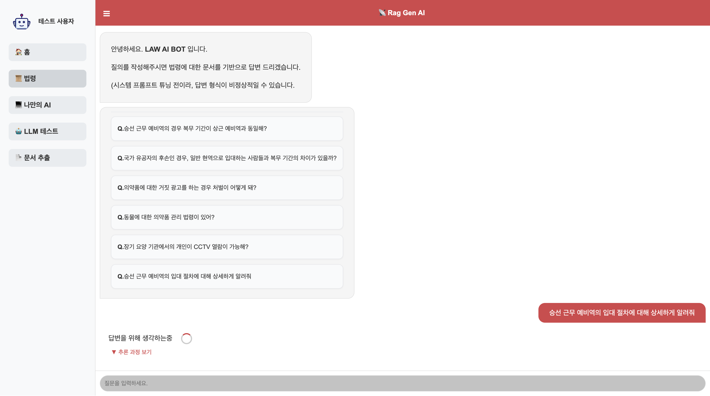
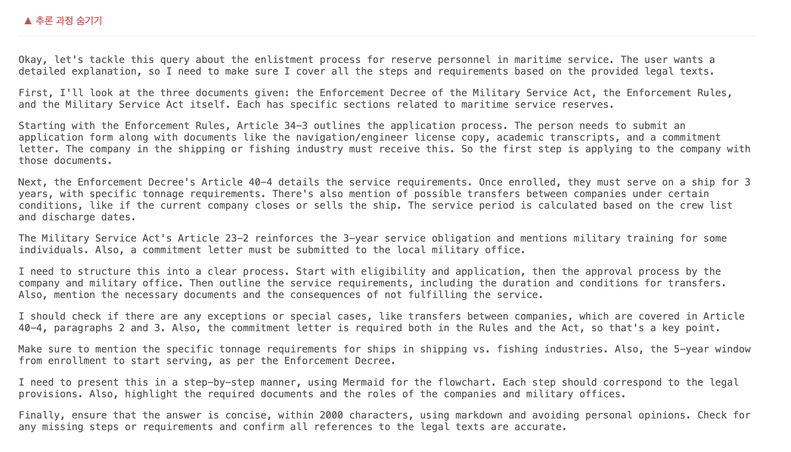
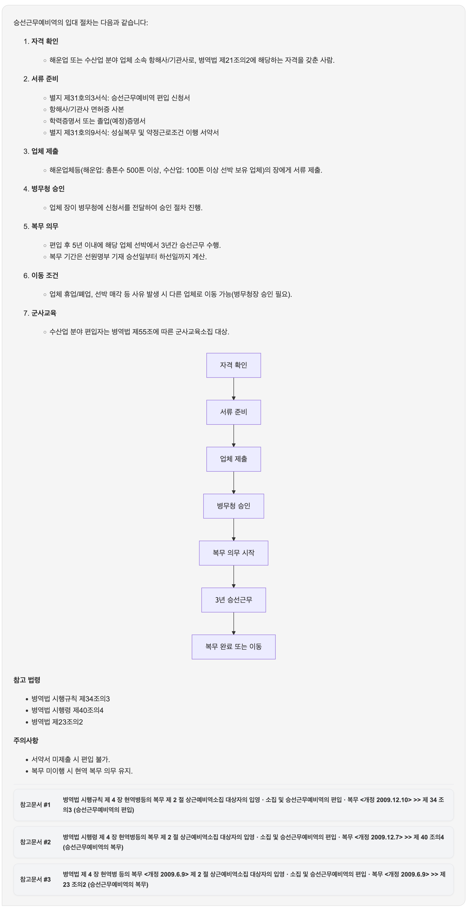
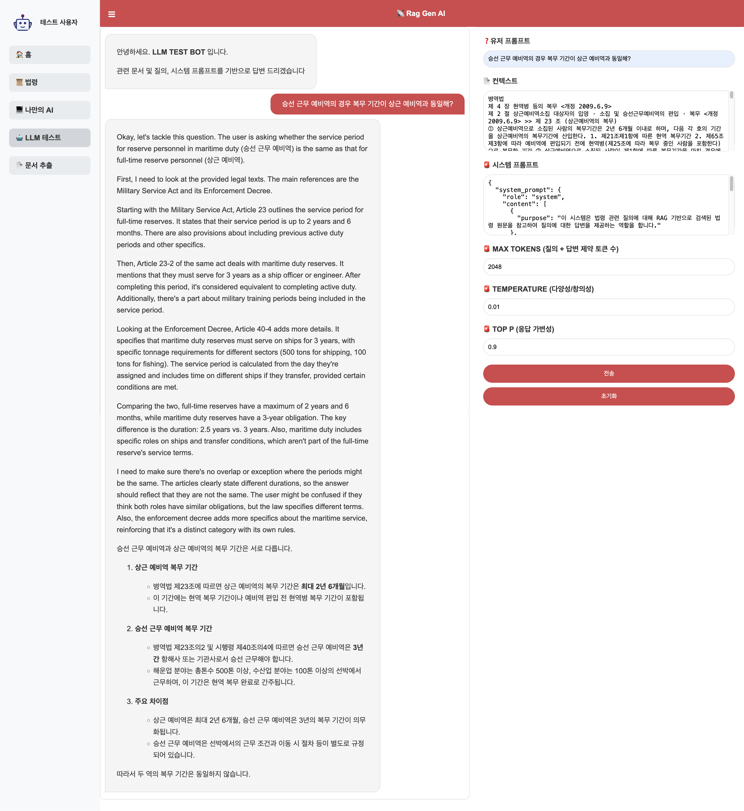

# rag-genAI

## 💻 기능

### 1. 법령 정보 질문 및 답변

법령과 관련된 전처리 문서들을 기반으로 검색한 데이터를 언어 모델로 전달하여 질문에 대한 답변을 테스트할 수 있습니다.







```json
{
  "system_prompt": {
    "role": "system",
    "content": [
      {
        "purpose": "이 시스템은 법령 관련 질의에 대해 RAG 기반으로 검색된 법령 원문을 참고하여 질의에 대한 답변을 제공하는 역할을 합니다."
      },
      {
        "rules": [
          "항상 마크다운 형식으로 답변을 합니다.",
          "항상 2000자 이내로 답변을 합니다.",
          "항상 검색된 법령 조항 또는 문서를 근거로 답변을 작성해야 합니다.",
          "검색 결과가 불충분하거나 관련 법령이 없을 경우, '관련 법령을 찾을 수 없습니다.'라고 답변합니다.",
          "개인적인 의견, 해석, 법률 자문은 하지 않습니다.",
          "간결하고 명확한 문장을 사용해야 합니다.",
          "전문 용어는 간단히 풀어서 설명합니다.",
          "항상 중립적이고 객관적인 톤을 유지합니다.",
          "각 문장을 개행으로 구분하여 답변을 작성해야 합니다.",
          "특정 프로세스 절차를 설명하는 경우, ***Mermaid*** 문법으로 절차에 대한 순서도를 포함하여 답변을 해야 합니다.",
        ]
      }
    ]
  }
}
```

### 2. LLM 테스트

언어 모델로 **유저 프롬프트 (질의문)**, **관련 문서(컨텍스트)**, **시스템 프롬프트** 를 전달 하여 관련 문서에 대한 답변 품질을 테스트할 수 있습니다.




---

## 🔨 환경 설정
```yml
server:
  port: 8080
spring:
  application:
    name: genai
  servlet:
    multipart:
      max-file-size: 300MB
      max-request-size: 300MB
springdoc:
  swagger-ui:
    path: /swagger-ui.html
  api-docs:
    path: /api-docs
engine:
  search:
    url: ${검색_API_연결_정보}
  reranker:
    url: ${리랭킹_API_연결_정보}
    model-name: ${리랭킹_모델명}
  llm:
    llama:
      url: ${Llama_API_서버_정보}
      model-name: ${Llama_모델명}
    qwen3:
      url: ${Qwen_API_서버_정보}
      model-name: ${Qwen_모델명}
```
